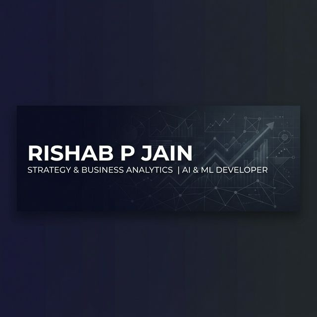

  

  <h1>Hi, I'm Rishab P Jain 🚀</h1>
  
<strong>Strategy & Business Analytics @ Christ University | Independent ML Developer | Future Strategy Consultant</strong>

---

### 👔 About Me
I am a **BBA Strategy & Business Analytics** student at Christ University, Bengaluru, dedicated to bridging the gap between sophisticated data engineering and commercial strategy. I specialize in building production-grade AI systems that solve real-world organizational problems.

- 📈 **Currently**: Building deep-learning financial dashboards and RAG-powered research pipelines.
- 🎓 **Research**: Under editorial review by **IGI Global** for a systematic review on generative AI's impact on decision-making.
- 💼 **Experience**: Previously a Business Operations Intern at **Hewlett Packard Enterprise (HPE)**.
- 🎯 **Goal**: To emerge as a technology-focused strategy consultant.

---

### 🛠️ Tech Stack & Tools

  
  
  
  
  

  
  
  
  
  

---

### 📊 GitHub Stats

  
  

  

---

### 🚀 Key Projects

- **[Nexus Equity Terminal](https://github.com/RishabJainhub/eq-analytics-terminal)**: An enterprise-style RAG dashboard for automated 10-K analysis.
- **[SME Credit Risk Platform](https://github.com/RishabJainhub/sme-credit-platform)**: XGBoost-powered risk engine calibrated on RBI data.
- **[Market Research Pipeline](https://github.com/RishabJainhub/market-research-pipeline)**: Multi-stage AI agent for real-time market synthesis.

---

### 📫 Let's Connect!

  
  

---

  *"Data is the raw material; strategy is the finished product."*

